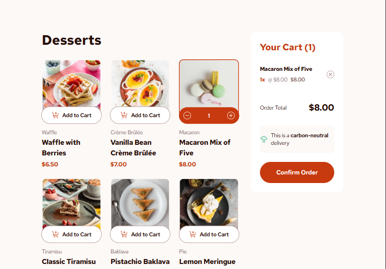
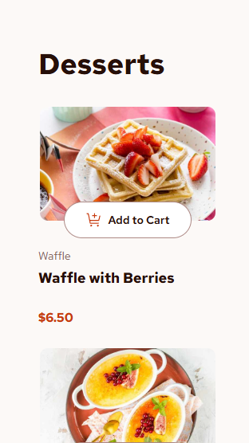
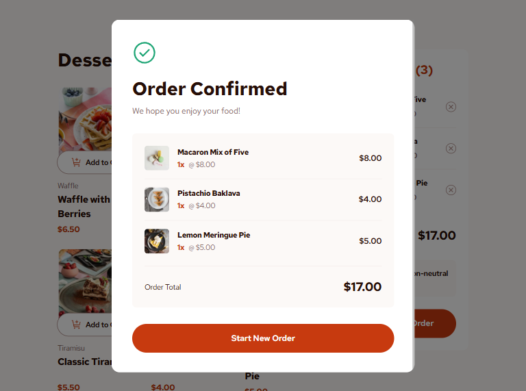

# Frontend Mentor - Product list with cart solution

This is a solution to the [Product list with cart challenge on Frontend Mentor](https://www.frontendmentor.io/challenges/product-list-with-cart-5MmqLVAp_d). Frontend Mentor challenges help you improve your coding skills by building realistic projects.

## Table of contents

- [Overview](#overview)
  - [The challenge](#the-challenge)
  - [Screenshot](#screenshot)
  - [Links](#links)
- [My process](#my-process)
  - [Built with](#built-with)
  - [What I learned](#what-i-learned)
- [Author](#author)

## Overview

### The challenge

Users should be able to:

- Add items to the cart and remove them
- Increase/decrease the number of items in the cart
- See an order confirmation modal when they click "Confirm Order"
- Reset their selections when they click "Start New Order"
- View the optimal layout for the interface depending on their device's screen size
- See hover and focus states for all interactive elements on the page

### Screenshot

|            Desktop Version            |           Mobile Version            |            Confirmation Modal            |
| :-----------------------------------: | :---------------------------------: | :--------------------------------------: |
|  |  |  |

### Links

- Solution URL: [GitHub Repository](https://github.com/BaskoroR725/28-Product-list-with-cart)
- Live Site URL: [Live Demo](https://baskoror725.github.io/28-Product-list-with-cart/)

## My process

### Built with

- Semantic HTML5 markup
- Mobile-first workflow
- [React](https://reactjs.org/) - JS Library (version 19)
- [Zustand](https://zustand-demo.pmnd.rs/) - State Management
- [Framer Motion](https://www.framer.com/motion/) - Animation Library
- [Tailwind CSS](https://tailwindcss.com/) - For styles (version 4)
- [Vitest](https://vitest.dev/) - Unit Testing Framework

### What I learned

This project was a great opportunity to practice global state management and complex UI animations.

1. **State Management with Zustand**: I learned how to create a clean, decoupled store for the shopping cart. Using `create` from Zustand allowed for a very intuitive API for adding, removing, and updating items.

2. **Complex Exit Animations**: Implementing smooth "slide-up" exit animations for cart items required a deep understanding of Framer Motion's `AnimatePresence`. I learned that preserving the list structure during the exit transition is key to preventing "jumpy" UI.

3. **Reliable Logic with Unit Testing**: By writing unit tests with Vitest, I ensured that price calculations and quantity updates work 100% accurately without having to manually test every edge case in the browser.

```typescript
// Example of a unit test for the cart store
it("should calculate total price correctly", () => {
  const { addItem, updateQuantity } = useCartStore.getState();
  addItem(mockProduct); // $6.50
  updateQuantity(mockProduct.name, 1); // 2x Waffle = $13.00

  const state = useCartStore.getState();
  const totalPrice = state.items.reduce(
    (sum, item) => sum + item.price * item.quantity,
    0,
  );
  expect(totalPrice).toBe(13.0);
});
```

## Author

- Frontend Mentor - [@BaskoroR725](https://www.frontendmentor.io/profile/BaskoroR725)
- GitHub - [Baskoro Ramadhan](https://github.com/BaskoroR725)
